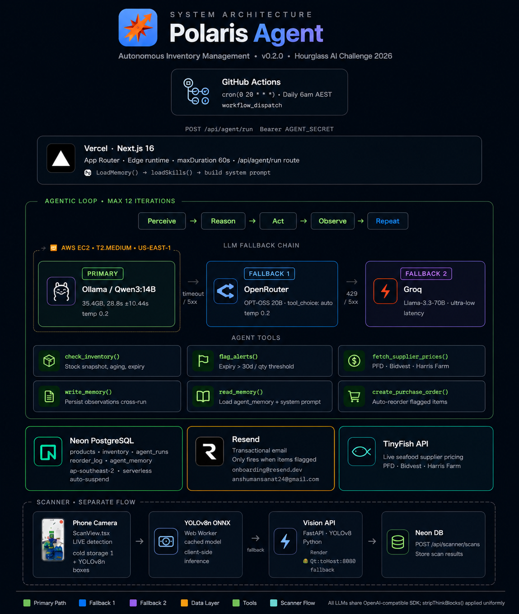

<p align="center">
  
</p>

<h1 align="center">Polaris — Autonomous Inventory Management Agent</h1>

<p align="center">
  Built for the <strong>Hourglass AI Challenge · May 2026</strong><br>
  <a href="https://polaris-agent.vercel.app">Live Demo</a> · <a href="https://github.com/Ansh0928/Polaris-Agent">GitHub</a> · <a href="https://hour-glass-ai-redesign.vercel.app/">Hourglass AI(re design)</a>
</p>

---

## Why This Problem

Every fresh food warehouse owner I've spoken to wants the same thing: to compete with Coles and Woolworths. They have the product, they have the relationships, they have the hustle. What they don't have is the infrastructure the systems that the big players run silently in the background, 24 hours a day, that mean nothing goes to waste and shelves are never empty.

In fresh food, expiry is everything. A missed expiry date doesn't just cost you money it costs you trust. And in this industry, trust takes years to build and a single incident to lose. For most owners, **time and trust matter more than anything else.** More than margin. More than technology.

After talking to owners across different industries, one thing kept coming up: **everyone is happy doing manual work — nobody wants to do admin.** And the bigger insight was around staff. Most SMBs run on hourly-wage workers. Any system that requires a person to actively engage every day will fail not because it's hard, but because it disrupts the routine they've already built. The real bottleneck isn't software — **it's the human in the loop.**

Polaris removes that manual work from the loop entirely, keeps the judgment for human. Kept an tour (at the bottom of the web app) - walkthrough to understand easy and fast. <a href="https://polaris-agent.vercel.app">Live Demo</a> 

---

## Judging Criteria

### 01 · AI-Nativeness — Is the agent truly autonomous?

> **Yes. No human touches it between runs.**

Every morning at 5am AEST, Polaris wakes up, checks the warehouse, reasons about what it finds, and acts — all without a single prompt from a person. It decides which tools to call, in what order, based on what it observes. It writes notes to its own memory and reads them back next run. The only human involvement is reading the email it sends.

The deeper insight: the real bottleneck in any SMB system isn't the software — it's the staff. Hourly-wage workers won't change their routine for a new tool, no matter how simple it is. Polaris doesn't ask them to. It runs in the background, does the admin nobody wants to do, and gets out of the way.

---

### 02 · Creativity & Ambition — Bold ideas over safe ones

> **Built a production AI agent with a $0 LLM bill.**

After the IPOs of major AI companies, API prices will go up — that's a certainty. And in a world where privacy still matters, I didn't want warehouse data flowing through closed models. So I challenged myself: can I build a capable, production-grade agent entirely on open-source?

The fallback chain: **AWS EC2 → OpenRouter → Groq** — all open-source models, all free tier. The agent tries self-hosted Qwen3:14B first. If EC2 is cold, it falls to GPT-OSS 20B on OpenRouter, then Llama-3.3-70B on Groq. Three layers of redundancy. Running cost for the AI layer: effectively $0.

The agent itself runs on the **Hermes 3 agentic pattern** — an open-source tool-calling framework that drives the reasoning loop. No proprietary agent SDK, no vendor lock-in. The tool loop, memory injection, and structured report synthesis are all built on Hermes conventions, open and auditable.

For live supplier pricing, Polaris integrates **TinyFish** — an external open-source-friendly API that scrapes real AUD prices from PFD, Bidvest, and Harris Farm in real time. Instead of building a fragile scraper from scratch, the agent calls TinyFish and gets back structured price data it can reason over. The right tool for the right job.

The principle: **find the best open systems, integrate them cleanly, and build only what doesn't exist yet.** That's how one developer in weeks ships something that would take a team months to build from scratch.

---

### 03 · Does It Work? — Show us it can handle the real world

> **Yes. Live, running daily, real data. The agent owns every decision and every outcome — and gets smarter with each run.**

Polaris is deployed at [polaris-agent.vercel.app](https://polaris-agent.vercel.app) and has been running against real inventory for 7+ days. In that window it made **22 tool calls**, flagged **10 expiring items**, identified **6 low-stock risks**, and generated purchase order recommendations — unprompted.

**End-to-end accountability:** no human is in the decision loop. The agent:

1. **Perceives** — calls `check_inventory`, gets a full warehouse snapshot with quantities, locations, expiry dates, and cost prices
2. **Reasons** — the LLM decides which tools to call next, in what order, based on what it observes — no hardcoded sequence
3. **Acts** — calls `flag_alerts` to surface expiry and reorder risks, `fetch_supplier_prices` to pull live AUD pricing from PFD, Bidvest, and Harris Farm, and `create_purchase_order` to draft the best reorder
4. **Remembers** — writes key observations (margin trends, supplier spikes, patterns) to persistent memory via `write_memory`, so the next run is informed by the last
5. **Reports** — synthesises a structured JSON report, builds an email, and sends it via Resend — only if items are flagged, never for noise

**It improves with every run.** Each cycle, the agent writes what it observed to memory — margin trends, supplier price spikes, patterns in stock movement. The next run reads that history back and reasons against it. More data means sharper decisions: the longer it runs, the more context it has, and the more accurate its recommendations become. Day 1 it flags expiry. Day 7 it notices the salmon margin has been sliding for a week.

Every decision is traceable. Every tool call is logged to the `agent_runs` table with full JSON output. Every memory write is queryable. The observability dashboard at [polaris-agent.vercel.app](https://polaris-agent.vercel.app) shows the full trace — tool call by tool call. Nothing is faked, nothing is mocked, nothing is cherry-picked.

The agent doesn't just flag problems. It decides what to do about them. That's the difference between automation and autonomy.

---

### 04 · Code Quality — How you think and build

> **Built through my own workflow, tested, hardened, no shortcuts.**

TypeScript strict throughout — no `any`, shared types in `src/types/index.ts`. Vitest unit tests on all pure functions (flagging logic, NMS, IoU, inference post-processing). Security reviewed: bearer auth on agent route, parameterised SQL only, XSS-safe email HTML builder. Agentic loop guards: `MAX_ITERATIONS = 9`, `temperature = 0.2`, `<think>` block stripping, non-fatal reorder log writes. Fallback chain wired in the LLM client — EC2 down doesn't break the run.

---

## The Free AI Stack

This is the part I'm most proud of.

Post-IPO, the major AI companies will raise prices. And in a world where privacy increasingly matters, I didn't want to depend on sending warehouse data to closed APIs. So I challenged myself: **can I build a production-grade AI agent at near-zero cost?**

The answer is yes.

| Priority | Model | Where | Why this model |
|---|---|---|---|
| Primary | **Qwen3:14B** | AWS EC2 via Ollama | Best-in-class tool calling at 14B scale. Qwen3 was specifically trained for agentic tasks — structured JSON output, multi-step reasoning, and function calling without hallucinating tool arguments. At 14B it fits comfortably on a single EC2 g4dn instance and runs inference fast enough for a daily 12-iteration loop. |
| Fallback 1 | **GPT-OSS 20B** | OpenRouter (free tier) | When EC2 is cold, GPT-OSS 20B via OpenRouter picks up instantly. Stronger general reasoning than Llama at similar scale. Free tier handles the agent's low call volume without rate limits. |
| Fallback 2 | **Llama-3.3-70B** | Groq (free tier) | Last resort — but paradoxically the most capable model in the chain. Groq's LPU inference makes 70B feel faster than most hosted 7B models. If OpenRouter throttles, Llama-3.3-70B on Groq delivers the most thorough analysis of the three. |

Every model in the chain was chosen for **tool-calling reliability and structured output** — the two things that matter in an agentic loop. A model that hallucinates a tool argument breaks the run. Qwen3, GPT-OSS, and Llama-3.3 are all proven on function-calling benchmarks. Temperature is fixed at 0.2 across all three — deterministic enough for inventory decisions, not so rigid it can't adapt to edge cases.

The agent tries EC2 first. If unavailable, it falls to OpenRouter, then Groq. Three layers of redundancy. All open-source. Running cost for the AI layer: effectively $0.

---

## Architecture



---

## Problems I Faced

The hardest part wasn't the code — it was the infrastructure.

The original plan was to self-host the LLM locally on my Mac and expose it to production. Simple idea. I searched everywhere for how to make that work reliably — tunneling through Cloudflare was the first attempt. It didn't work. Kept hitting walls: connection drops, timeouts, no stable way to keep a local machine as a production dependency.

Eventually landed on AWS EC2. Setting up the instance, getting Ollama running, configuring IMDSv2 for metadata security, making the fallback chain reliable — that took far longer than any of the application code. But it worked, and it's the right architecture: a real server, not my laptop.

The lesson: **the jaggedness of building something new is that you don't know what you don't know.** You plan, hit a wall, search, pivot, and eventually find the path. That process is the job.

---

## Future Scope

Implement best practices tailored to each organisation's operational needs. Propose moving from services to a product — an AI-native SaaS layer that SMBs subscribe to, not a one-time build. The repeatable value is in the agent running daily, not the initial setup. Build brand presence through AEO, GEO, and SEO — story-led companies build more trust than feature-led ones.

**Personally:**
I want to have an impact and be around people doing far better than me. I heard recently: *"if you're the best programmer at your company, you're at the wrong company."* I want to learn, take feedback, iterate, and grow — for myself and for whoever I'm building with.

---

## What It Does

Every morning at 5am AEST, Polaris runs autonomously:

**Checks the warehouse** — full inventory snapshot with quantities, locations, and expiry dates

**Expiry alerts** — flags anything expiring within 7 days before it becomes waste

**Low stock alerts** — flags items below reorder threshold before shelves go empty

**Intelligent ordering** — fetches live prices from multiple suppliers and recommends the best reorder option

**Margin intelligence** — compares wholesale cost prices against live retail prices, detects erosion trends

**Emails a report** — full daily summary delivered before the warehouse opens

**Remembers** — writes observations to persistent memory, so each run is informed by the last

> *"Salmon margin dropped 4.5% this week — supplier price spike noted. Recommend holding reorder until next cycle."*

That's the agent reasoning across runs without being told to.

---

## Memory — How It Gets Smarter

After each run the agent writes key observations to a persistent `agent_memory` table:

```
key: "salmon_margin_trend"
value: "Week 1: 62%. Week 2: 57.5%. Declining — supplier spike on Atlantic salmon."
```

Next run, that row is injected into the system prompt. The agent reads its own history and reasons against it. Trends emerge without any human intervention — just the agent watching itself across time.

---

## Agent Tools

The LLM decides which tools to call and in what order — no hardcoded sequence.

| Tool | What it does |
|---|---|
| `check_inventory` | Full warehouse snapshot: quantities, expiry dates, cost prices, locations |
| `flag_alerts` | Items expiring ≤7 days or below reorder threshold |
| `check_website_prices` | Live retail prices from the public storefront |
| `fetch_supplier_prices` | Live AUD prices from PFD, Bidvest, Harris Farm |
| `create_purchase_order` | Drafts reorder for the best-priced supplier |
| `write_memory` | Persists observations across runs |
| `read_memory` | Loads prior context into the current run |

---

## Margin Intelligence

Each run the agent:
1. Gets warehouse cost prices via `check_inventory`
2. Gets live retail prices via `check_website_prices`
3. Calculates: `margin = (retail − cost) / retail × 100`
4. Flags erosion against memory from previous runs

Thresholds: **Healthy ≥ 45%** · **Warning 30–44%** · **Critical < 30%**

---

## Tech Stack

| Layer | Technology |
|---|---|
| Framework | Next.js 16 (App Router) |
| Language | TypeScript |
| Database | Neon serverless PostgreSQL |
| AI — Primary | Qwen3:14B via Ollama on AWS EC2 |
| AI — Fallback | GPT-OSS 20B via OpenRouter / Llama-3.3-70B via Groq |
| Retail Price Scraping | Live storefront API |
| Email | Resend |
| Deployment | Vercel |
| Scheduler | GitHub Actions cron |
| Styling | Tailwind CSS v4 |
| Package Manager | Bun |

---

## License

MIT
